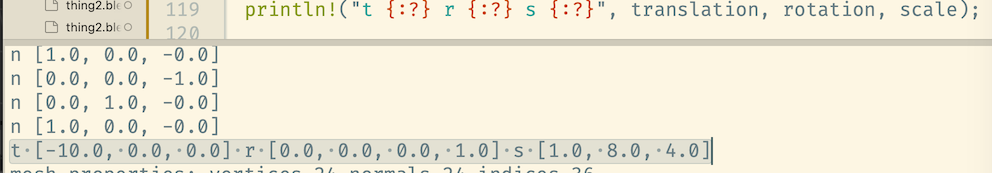

# vulkano-gltf-learning-rs
[https://github.com/bogdad/vulkano-gltf-learning-rs](https://github.com/bogdad/vulkano-gltf-learning-rs)

## Questions:
- how do vertex normals work
+ how do coordinate systems work

## Coordinate systems:
Gltf default camera: “and the default camera sits on the -Z side looking toward the origin with +Y up”

(Dimensions of the box (x:1 y:4 z:16)
But:

I.e. blender gltf export swaps y and z. Weird.

What is blender convention:
* The /X-axis/ typically represents side-to-side movement.
* The /Y-axis/ represents front-to-back movement.
* The /Z-axis/ goes from top to bottom.

So, `blender gltf exporter` converts coordinate systems: swaps Y and Z. 
If you are designing an asset in blender to be viewable in the default camera in gltf (sitting in -Z:`[0, 0, -1]` pointing towards +Z `[0, 0, 1]` pointing up and with +Y`[0, 1, 0]`
